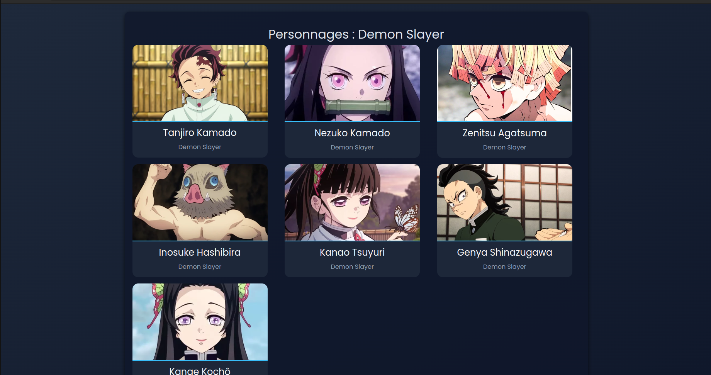
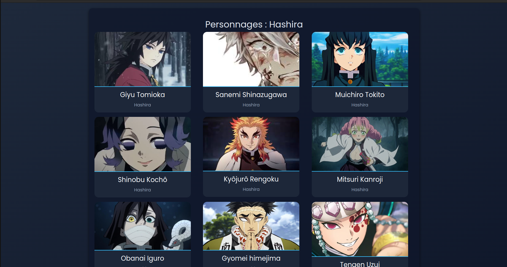
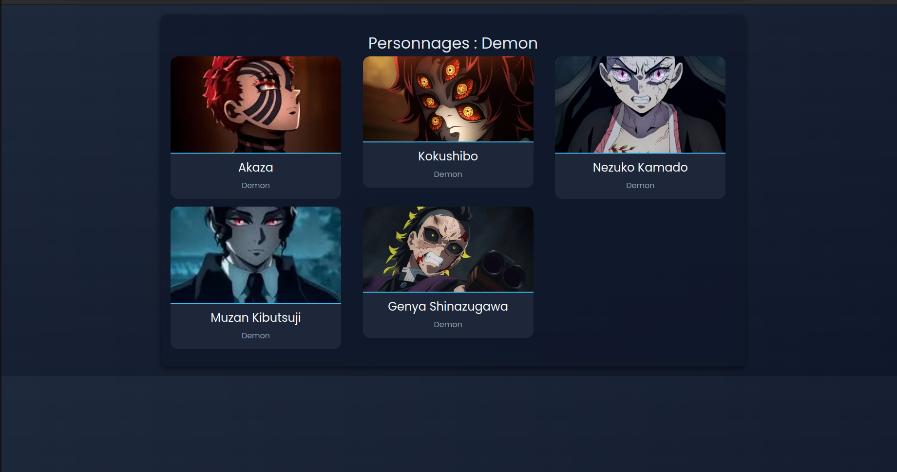

# Demon Slayer Characters App

Une application Angular pour afficher les personnages de **Demon Slayer** par catégorie avec leurs images.

---

## 🚀 Fonctionnalités
- Affiche les personnages par catégorie.
- Utilise des URLs pour afficher les images.
- Design moderne avec CSS personnalisé.
- Responsive pour mobile et tablette.

---

## 🛠️ Installation

1. Clonez ce dépôt :
   ```bash
   git clone https://github.com/votre-utilisateur/demon-slayer-characters.git
   cd demon-slayer-characters


## Structure du Projet

```
src/
├── app/
│   ├── components/
│   │   ├── category-list/
│   │   │   ├── category-list.component.ts
│   │   │   ├── category-list.component.html
│   │   │   └── category-list.component.css
│   │   ├── character-list/
│   │   │   ├── character-list.component.ts
│   │   │   ├── character-list.component.html
│   │   │   └── character-list.component.css
│   ├── models/
│   │   └── character.model.ts
│   ├── services/
│   │   └── character.service.ts
│   ├── app-routing.module.ts
│   ├── app.component.ts
│   └── app.module.ts
└── styles.css
```

## 🌟 Résultat

- Les catégories affichent une liste de liens cliquables.
- Les personnages s'affichent avec leurs images et leurs noms, selon la catégorie.

## 🖼️ Capture D'écran du Site :







